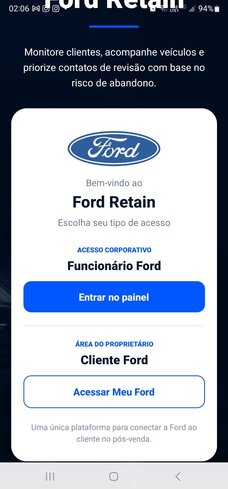
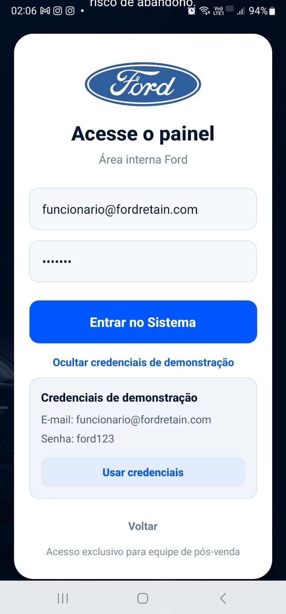
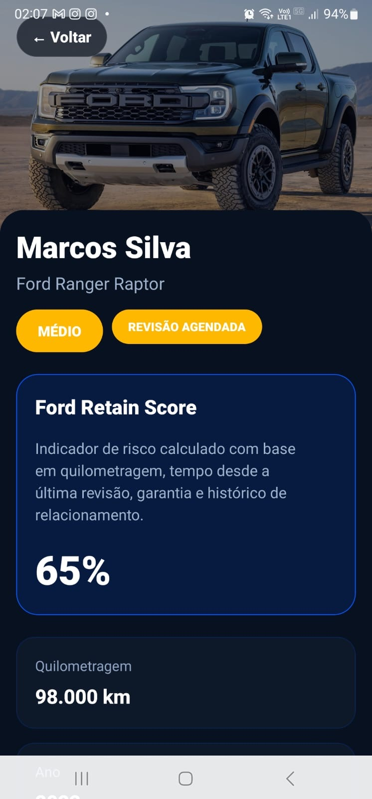
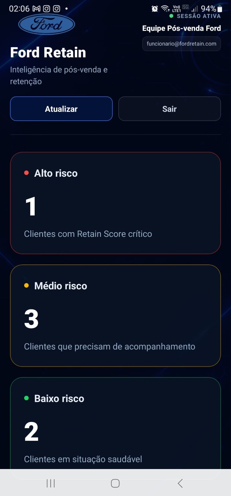
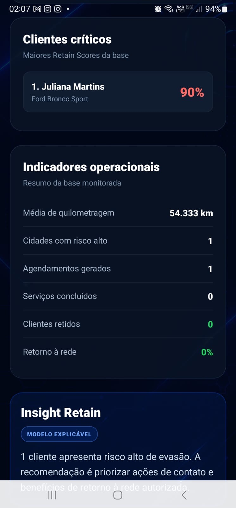
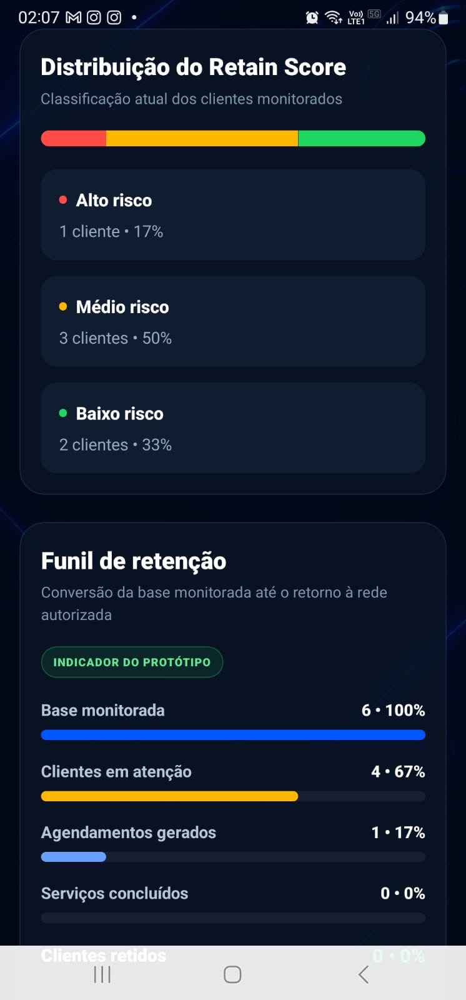
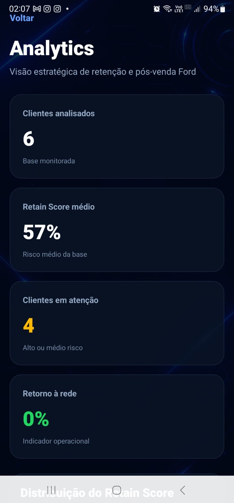
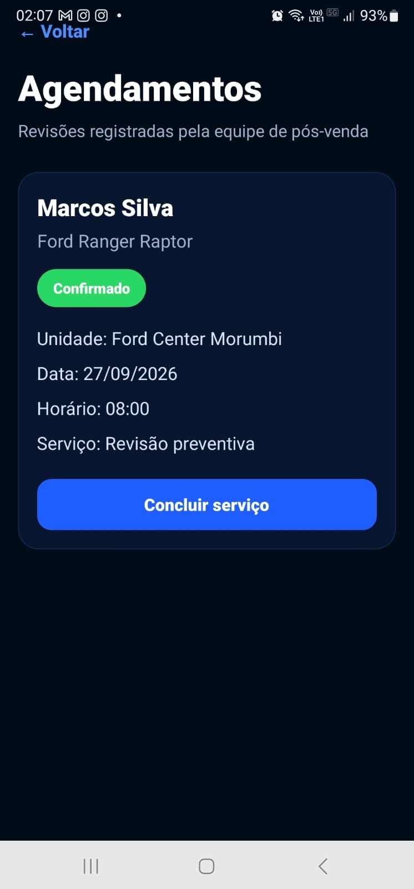
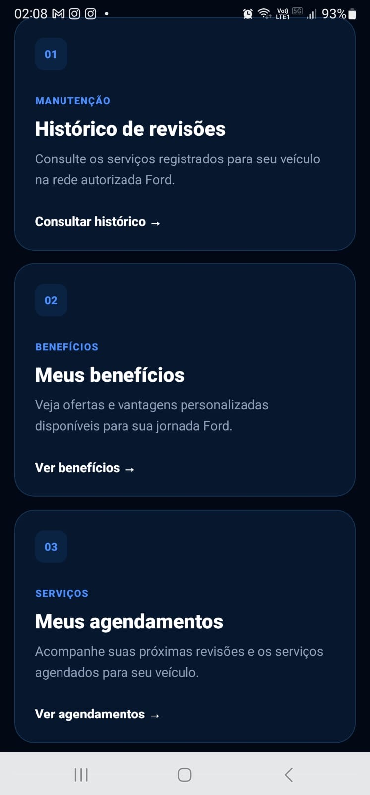
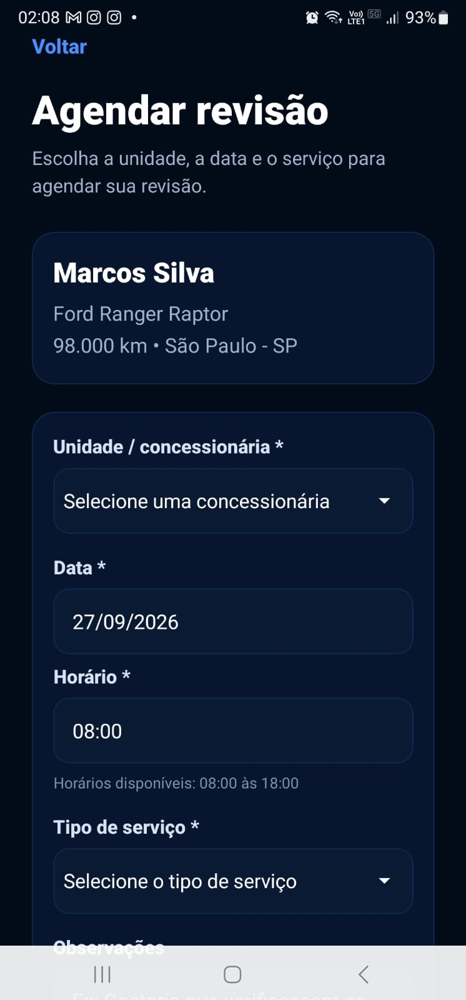

# Ford Retain

Plataforma inteligente de retenção pós-venda desenvolvida para apoiar a Ford e sua rede de concessionárias na identificação de clientes com maior risco de evasão e na criação de jornadas de retenção.

O projeto foi desenvolvido para o **Challenge Ford — Pós-Vendas**, integrando análise de risco, gestão de clientes, acompanhamento de revisões, agendamentos e uma jornada dedicada ao proprietário Ford.

A solução possui duas experiências integradas:

- **Painel corporativo**, utilizado pela equipe de pós-venda.
- **Meu Ford**, voltado ao proprietário do veículo.

---

# Objetivo da solução

O Ford Retain busca apoiar a retenção de clientes dentro da rede autorizada Ford.

A plataforma utiliza informações do cliente, do veículo e do histórico de pós-venda para identificar situações que podem representar maior risco de abandono.

A partir dessas informações, a equipe consegue:

- Identificar clientes prioritários.
- Visualizar fatores relacionados ao risco.
- Acompanhar veículos e revisões.
- Registrar ações de retenção.
- Agendar serviços.
- Acompanhar agendamentos.
- Oferecer benefícios de retenção.
- Aproximar a jornada do cliente da operação de pós-venda.

O fluxo principal da solução é:

```text
Dados do cliente e veículo
        ↓
Análise de risco
        ↓
Priorização do cliente
        ↓
Ação de retenção
        ↓
Benefício / contato
        ↓
Agendamento da revisão
        ↓
Atendimento na concessionária
        ↓
Retenção do cliente
```

---

# Funcionalidades

## Painel corporativo

O acesso corporativo foi desenvolvido para a operação de pós-venda.

Principais funcionalidades:

- Login de funcionário.
- Autenticação utilizando JWT.
- Dashboard de retenção.
- Indicadores por nível de risco.
- Clientes prioritários.
- Gestão de clientes e veículos.
- Busca de clientes.
- Filtros por risco.
- Visualização detalhada do cliente.
- Atualização do status de acompanhamento.
- Atualização de quilometragem.
- Visualização dos fatores de risco.
- Sugestão de ação de retenção.
- Gestão de agendamentos.
- Conclusão de atendimentos.
- Analytics operacionais.

---

# Meu Ford

O Ford Retain também possui uma jornada dedicada ao proprietário.

Por meio da área **Meu Ford**, o cliente pode acessar informações relacionadas ao seu veículo e ao pós-venda.

Entre as funcionalidades estão:

- Acesso autenticado do cliente.
- Visualização dos dados do veículo.
- Consulta da quilometragem.
- Informações sobre revisão.
- Situação da garantia.
- Visualização de benefício de retenção.
- Agendamento de revisão.
- Seleção de concessionária.
- Escolha de data e horário.
- Consulta dos próprios agendamentos.

A jornada demonstra como ações identificadas pela operação de pós-venda podem chegar ao cliente por meio de uma experiência digital integrada.

---

# Dashboard

O dashboard apresenta uma visão geral da operação de retenção.

Entre os indicadores disponíveis estão:

- Clientes classificados como alto risco.
- Clientes próximos da revisão.
- Clientes classificados como baixo risco.
- Clientes prioritários para contato.
- Acesso rápido aos principais módulos.

---

# Clientes

O módulo de clientes permite:

- Listagem de clientes e veículos.
- Busca por informações do cliente.
- Filtros por nível de risco.
- Visualização de informações de contato.
- Consulta de veículo e quilometragem.
- Acompanhamento do status de retenção.
- Acesso à tela detalhada de cada cliente.

---

# Detalhes do cliente

A tela de detalhes concentra informações relevantes para a estratégia de retenção:

- Dados pessoais.
- Informações de contato.
- Veículo.
- Quilometragem atual.
- Próxima revisão.
- Última revisão.
- Situação da garantia.
- Classificação de risco.
- Motivos associados ao risco.
- Sugestão de ação.
- Status do acompanhamento.
- Histórico relacionado ao pós-venda.

---

# Retain Score

O Ford Retain utiliza um mecanismo chamado **Retain Score** para auxiliar na priorização dos clientes.

O score considera fatores relacionados ao pós-venda, como:

- Quilometragem.
- Tempo desde a última revisão.
- Situação da garantia.
- Status atual do relacionamento com o cliente.

O resultado é convertido em uma pontuação de **0 a 100** e utilizado para classificar o cliente em:

- **Baixo risco**
- **Médio risco**
- **Alto risco**

O Retain Score funciona como uma regra de apoio à decisão e priorização operacional.

> Nesta versão do projeto, o Retain Score é baseado em regras de negócio e não representa um modelo de Machine Learning treinado.

---

# Analytics

O módulo de Analytics apresenta informações consolidadas para apoiar a operação de pós-venda.

Entre os dados apresentados estão:

- Distribuição dos clientes por nível de risco.
- Indicadores operacionais.
- Informações relacionadas à quilometragem.
- Visão consolidada da carteira de clientes.
- Dados para auxiliar na priorização das ações de retenção.

---

# Agendamentos

O sistema possui um fluxo completo para agendamento de revisões.

É possível:

- Selecionar uma concessionária.
- Escolher uma data.
- Escolher um horário.
- Informar o tipo de serviço.
- Adicionar observações.
- Consultar agendamentos.
- Acompanhar o status.
- Concluir atendimentos.

Também foram implementadas regras de negócio para evitar agendamentos inválidos, incluindo validações relacionadas à data e ao horário de atendimento.

---

# Autenticação e segurança

O Ford Retain utiliza autenticação baseada em **JWT (JSON Web Token)**.

Após o login, o backend gera um token utilizado nas requisições às rotas protegidas da API.

O sistema possui separação entre:

- Funcionário.
- Cliente.

As permissões são verificadas no backend antes do acesso aos recursos protegidos.

Além disso:

- Senhas são protegidas utilizando **bcrypt**.
- Rotas sensíveis exigem autenticação.
- O backend valida permissões de acesso.
- O aplicativo mantém a sessão autenticada utilizando armazenamento local seguro da aplicação.

---

# Tecnologias utilizadas

## Front-end

- React Native
- Expo
- Expo Router
- TypeScript
- React Hooks
- AsyncStorage
- Responsive Design

## Back-end

- Node.js
- Express
- API REST
- JWT
- bcrypt
- CORS

## Banco de dados

- SQLite

## Deploy e distribuição

- Vercel — aplicação web
- Render — API/backend
- Expo EAS Build — geração do aplicativo Android

---

# Arquitetura

A solução segue uma arquitetura baseada em aplicação cliente, API REST e banco de dados.

```text
┌──────────────────────────────┐
│         Ford Retain          │
│                              │
│ React Native + Expo Router   │
│                              │
│ Funcionário     Cliente      │
└──────────────┬───────────────┘
               │
               │ HTTPS / JSON
               │ JWT
               ▼
┌──────────────────────────────┐
│           API REST           │
│                              │
│ Node.js + Express            │
│ Autenticação + Regras        │
└──────────────┬───────────────┘
               │
               ▼
┌──────────────────────────────┐
│            SQLite            │
│                              │
│ Usuários                     │
│ Clientes                     │
│ Veículos                     │
│ Agendamentos                 │
└──────────────────────────────┘
```

---

# API REST

A aplicação possui backend próprio responsável pelas regras de negócio, autenticação e comunicação com o banco de dados.

## Autenticação

```text
POST /login
POST /login-cliente-demo
```

## Usuários

```text
POST /usuarios
```

## Clientes

```text
GET /clientes
GET /clientes/:id
PUT /clientes/:id/status
PUT /clientes/:id/quilometragem
GET /clientes/:id/agendamentos
```

## Agendamentos

```text
GET /agendamentos
POST /agendamentos
PUT /agendamentos/:id/concluir
```

## Concessionárias

```text
GET /concessionarias
```

As rotas protegidas utilizam:

```text
Authorization: Bearer <token>
```

---

# Deploy

## Front-end Web

A versão web do Ford Retain está publicada na Vercel:

https://ford-retain.vercel.app

## Backend

A API está publicada no Render:

https://challenge-2026-master.onrender.com

A aplicação utiliza o backend publicado configurado em:

```text
src/services/api.ts
```

```ts
const API_URL =
  "https://challenge-2026-master.onrender.com";
```

---

# APK Android

A aplicação possui uma versão Android gerada através do **Expo EAS Build**.

O build utiliza o perfil:

```text
preview
```

Comando utilizado:

```bash
npx eas-cli build -p android --profile preview
```

O APK foi instalado e validado em dispositivo Android físico.

Foram testados os principais fluxos da aplicação, incluindo:

- Inicialização do aplicativo.
- Responsividade mobile.
- Login do funcionário.
- Autenticação JWT.
- Dashboard.
- Consulta de clientes.
- Detalhes do cliente.
- Agendamentos.
- Logout.
- Acesso ao Meu Ford.
- Jornada do proprietário.

---

# Responsividade

O Ford Retain foi desenvolvido para diferentes tamanhos de tela.

A interface possui adaptações para:

- Desktop.
- Tablet.
- Smartphone.

No aplicativo mobile, telas com maior quantidade de conteúdo possuem navegação vertical para garantir acesso aos componentes em diferentes tamanhos de dispositivo.

---

# Como executar o projeto

## 1. Clonar o repositório

```bash
git clone https://github.com/LorenzzoDiass/Challenge-2026-master.git
```

Entre na pasta:

```bash
cd Challenge-2026-master
```

## 2. Instalar as dependências

```bash
npm install
```

## 3. Executar o aplicativo

```bash
npx expo start
```

Para executar a versão web:

```bash
npx expo start --web
```

---

# Executando o backend localmente

Entre na pasta do backend:

```bash
cd backend
```

Instale as dependências:

```bash
npm install
```

Execute:

```bash
node server.js
```

Por padrão, o backend local utiliza a porta:

```text
3001
```

> A versão publicada da aplicação utiliza a API hospedada no Render.

---

# Estrutura principal

```text
Challenge-2026-master/
│
├── backend/
│   ├── server.js
│   └── ...
│
├── src/
│   ├── app/
│   ├── assets/
│   ├── components/
│   ├── services/
│   └── ...
│
├── app.json
├── eas.json
├── package.json
└── README.md
```

---

# Persistência de dados

O projeto utiliza **SQLite** como banco de dados.

Localmente, os dados ficam armazenados no arquivo do banco e permanecem disponíveis entre reinicializações da aplicação enquanto o arquivo é preservado.

> Na hospedagem gratuita atual do backend, a persistência do arquivo SQLite depende do ambiente de execução. Para um cenário de produção, a arquitetura pode ser evoluída para utilizar um banco de dados persistente gerenciado.

---

# Próximas evoluções

Possíveis evoluções do Ford Retain incluem:

- Modelo preditivo de Machine Learning para estimativa de evasão.
- Integração com fontes reais de dados da Ford.
- Notificações de revisão.
- Recuperação de senha.
- Expansão dos benefícios personalizados.
- Histórico completo da jornada do cliente.
- Evolução dos dashboards.
- Banco de dados gerenciado para ambiente produtivo.
- Monitoramento e observabilidade da API.

---

# Challenge Ford — Pós-Vendas

Projeto acadêmico desenvolvido para o Challenge Ford, com foco em soluções digitais para retenção e relacionamento no pós-venda.

## Integrantes

- **Lorenzzo Vendruscolo Dias** — RM558305
- **Gabriel Martins Vannucci** — RM556883
- **Miguel Marques Lourenço** — RM555426
- **Pedro Henrique Ferronato** — RM554757
- **Athos Rodrigues Alves** — RM555515

---

# Repositório

GitHub:

https://github.com/LorenzzoDiass/Challenge-2026-master

---

# Demonstração da aplicação

A seguir estão algumas telas da versão final do Ford Retain executada em dispositivo Android físico.

## Acesso ao Ford Retain





## Painel corporativo


## Clientes e veículos




## Retain Score





## Analytics





## Agendamentos



## Meu Ford






